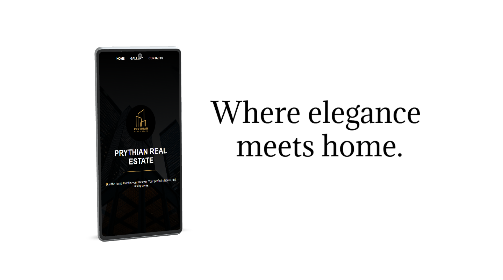

# Prythian Real Estate 🏠

**Prythian Real Estate** is a modern real estate finder app that allows you to view detailed property information such as price, size, location, and amenities, along with photos.



## Project Setup Guide

This guide will walk you through setting up a Vite project with vanilla JavaScript and adding Sass for styling.

### 1️⃣ Node.js & npm

Make sure you have Node.js installed. You can check by running:

```
node -v
npm -v
```

If it's not installed, download it from (https://nodejs.org/en) nodejs.org and install it.

### 2️⃣ Download or Clone the Project

Open your terminal and run the following command:

```
git clone https://autocode.git.epam.com/deabocina9/capstone-project-template.git
```

### 3️⃣ Install Project Dependencies

Open a terminal inside the project folder and run:

```
npm install
```

This will download all necessary packages listed in package.json. If Vite is not listed in devDependencies, install it manually:

```
npm install vite --save-dev
```

### 4️⃣ Compile Sass

Since the project uses Sass, you need to compile SCSS files into CSS. Run:

```
npm run compile
```

### 5️⃣ Start the Development Server

Run the following command to start the project:

```
npm run dev
```

This will launch a local server (default: http://localhost:5173/). You should now see the project running in your browser.

## 🏘️ Explore Real Estate Listings

Find your dream home effortlessly!

- Browse available properties across different categories and price ranges.
- See essential info like **location**, **size**, **price** and **amenities** at a glance.

## 🔍 Smart Property Search

Easily find what you're looking for!

- Search properties by name, location, area or price.
- **Filter through listings** with ease to find exactly what fits your needs.

## 🖼️ Property Images

See it before you visit!

- Every property comes with a dedicated image to give you a clear idea of what to expect.
- A **visual-first approach** to browsing real estate.

## 🗺️ Interactive Map

Get the bigger picture!

- View the location of our real estate office directly on an **interactive map**.
- Built using **Leaflet.js** for smooth and responsive navigation.
